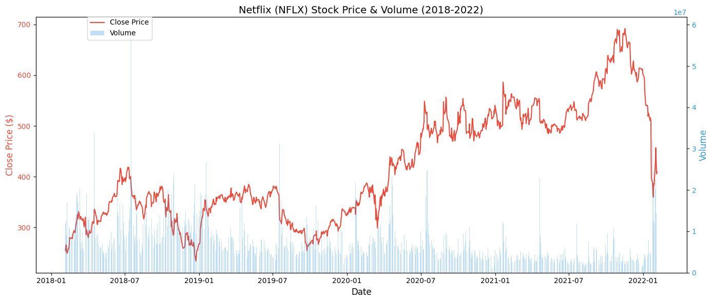
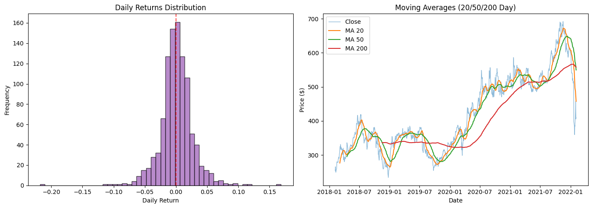
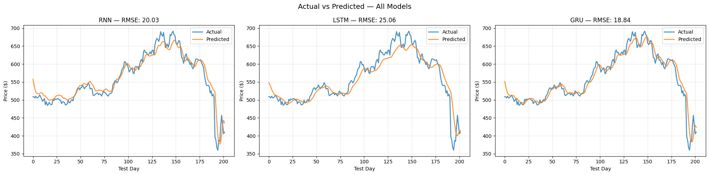
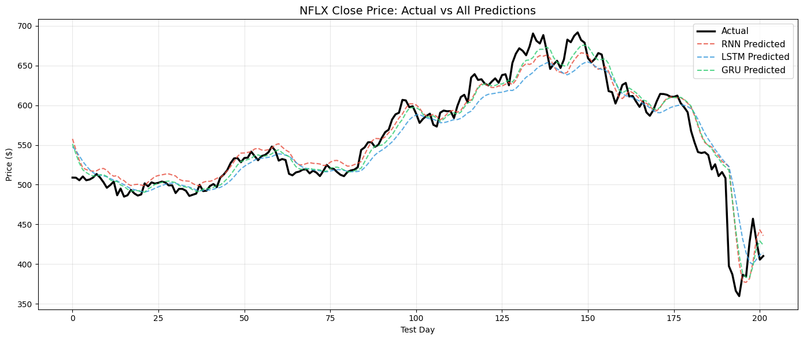
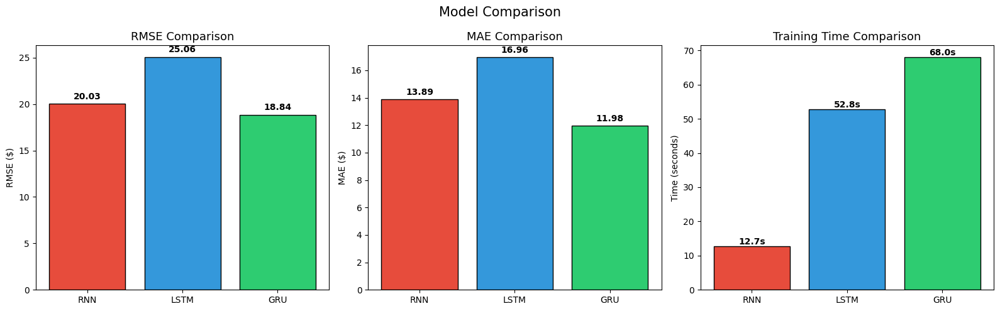
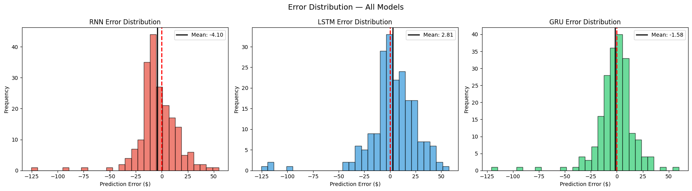

# M3-Project02
 
## **Netflix Stock Price Forecasting: RNN vs LSTM vs GRU with Streamlit Deployment**
 
## Introduction
 
- In this project, we developed an AI‑powered system to forecast Netflix (NFLX) stock prices using three sequential deep learning architectures Recurrent Neural Networks (RNN), Long Short‑Term Memory networks (LSTM), and Gated Recurrent Units (GRU).
Our objective was to evaluate the performance of each model, understand their strengths and limitations, and identify the most effective architecture for short‑term stock forecasting.
 
- The project also included a detailed analysis of market behavior, model training, error evaluation, and future prediction using a recursive forecasting approach.
 
## **Market Data Exploration**
 
-We began by analyzing historical Netflix stock data, including:
 
-> Closing prices
 
-> Trading volume
 
-> Moving averages (MA20, MA50, MA200)
 
These visualizations helped us understand market momentum and structural patterns.
 
- The stock price and volume chart  showed that:
 
- Price increases with low volume often indicate weak trends
 
- Price drops with high volume signal strong selling pressure
 
- Volume spikes frequently align with major news or trend reversals
 
- The moving averages chart further highlighted short, medium, and long term trends.
 
## **Model Architectures**
# Recurrent Neural Network (RNN)
- RNNs maintain a hidden state that carries information across timesteps. However, they struggle with long‑term dependencies due to the vanishing gradient problem, which limits their ability to remember patterns over long sequences.
 
# Long Short‑Term Memory (LSTM)
- LSTMs use three gates to manage information, enabling long‑term memory but adding complexity.
 
Forget gate — erases info
 
Input gate — adds info
 
Output gate — reveals info
 
 
# Gated Recurrent Unit (GRU)
GRUs simplify the LSTM design by using only two gates:
 
- Update gate — controls how much past information to keep
 
- Reset gate — controls how much of the previous state to forget
 
This streamlined structure allows GRUs to capture long‑term dependencies effectively while training faster and using fewer parameters.
 
## **Model Performance Evaluation**
Across all metrics, the GRU model demonstrated the strongest performance.
 
From our evaluation:
 
-> GRU achieved the lowest RMSE (18.49)
 
-> GRU achieved the lowest MAE and MAPE
 
-> GRU produced the most stable prediction curves
 
-> GRU tracked the actual price most closely in the zoomed 60‑day window [zoomed 60 window](asgn_fig_zoomed60.png)
 
The model comparison  charts clearly show GRU outperforming both RNN and LSTM in accuracy, while maintaining reasonable training time.
 
The error distribution plots  also highlight GRU’s advantage, with a narrower and more centered error curve compared to the wider spread seen in RNN and LSTM.
 
## **Why GRU Outperformed the Others**
 
The GRU architecture provided the best balance between memory retention and computational efficiency.
Its gating mechanism allowed it to:
 
-> Capture long‑term dependencies better than RNN
 
-> Train faster and generalize better than LSTM
 
-> Avoid overfitting on a moderately sized dataset
 
-> Produce smoother and more stable predictions
 
The zoomed 60‑day comparison plot [zoomed 60 window](asgn_fig_zoomed60.png) visually confirms that GRU predictions aligned most closely with actual price movements.
 
## **Challenges in Time‑Series Forecasting**
Time‑series forecasting presents several challenges that differ from standard classification tasks.
 
# 1. Temporal Dependency
Time‑series data is sequential, meaning each value depends on previous values.
To address this, we:
 
- Preserved chronological order
 
- Avoided shuffling
 
- Used a 60‑day sequence window
 
- Employed RNN/LSTM/GRU architectures designed for sequential patterns
 
# 2. Non‑Stationarity
Stock prices change over time due to trends, volatility, and external events.
We mitigated this by:
 
- Normalizing data using MinMaxScaler
 
- Using models capable of adapting to shifting patterns
 
# 3. Data Leakage
Future information must never influence training.
We prevented leakage by:
 
- Fitting MinMaxScaler only on training data
 
- Applying the same scaler to validation and test sets
 
This ensured realistic evaluation and prevented *look ahead* bias.
 
## **Why MinMaxScaler Must Be Fit on Training Data Only**
Fitting MinMaxScaler on the entire dataset would allow future values to influence the scaling process, introducing data leakage.
This would result in:
 
- Unrealistically low test error
 
- Overly optimistic performance metrics
 
- Poor real‑world generalization
 
By fitting the scaler only on training data, we ensured that the model learned strictly from historical information, mirroring real world forecasting conditions.
 
## **Limitations of Recursive Forecasting**
Our project used recursive forecasting, where each predicted value becomes the input for the next prediction.
This approach has inherent limitations:
 
1. Error Accumulation
Small early errors compound over time, causing long‑range forecasts to drift.
 
2. Increasing Uncertainty
The model is trained on real data but predicts using its own outputs, causing distribution mismatch.
 
3. Smoother, Less Reactive Forecasts
Recursive predictions tend to be smoother and less responsive to sudden market changes.
 
4. Sensitivity to Initial Conditions
The entire future depends on the final 60‑day window.
 
These effects are visible in the 30‑day future prediction plot, where the forecast becomes smoother and gradually diverges from historical volatility.
 
## **Future Improvements**
If more time were available, we would enhance the project in several ways:
 
1. Multi‑Feature Inputs
Use additional features such as:
 
Open, High, Low, Volume indicators
 
would provide richer context and improve predictive accuracy.
 
2. Attention Mechanisms
Attention layers would allow the model to focus on the most relevant timesteps, improving long‑term forecasting.
 
3. Advanced Architectures
We could explore:
 
- Transformer networks
 
- CNN‑LSTM or CNN‑GRU hybrids
 
- Seq2Seq encoder‑decoder models
 
These architectures reduce recursive error accumulation and improve long‑horizon accuracy.
 
4. Hyperparameter Optimization
Using Optuna or KerasTuner optimization could refine:
 
Learning rate, Hidden size, Dropout, Sequence length
 
5. Ensemble Learning
Combining predictions from multiple models would reduce variance and improve stability.
 
## **Conclusion**
This project demonstrated how deep learning models can be applied to financial time‑series forecasting.
Among the three architectures tested, the GRU model delivered the best overall performance, thanks to its efficient gating mechanism and strong ability to capture long‑term dependencies.
 
The project also emphasized the importance of proper preprocessing, preventing data leakage, preserving temporal order, understanding recursive forecasting limitations
 
Overall, this project successfully combined deep learning, financial forecasting, and model evaluation into a complete AI‑powered stock prediction system.
 